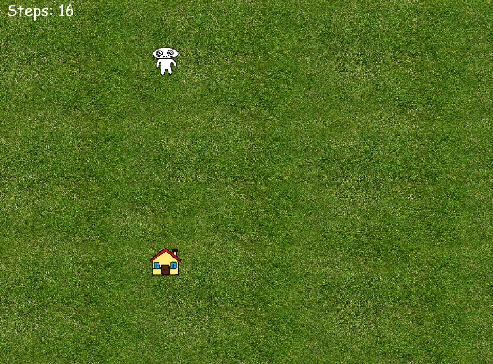

A game made with JavaScript and Kaplay that utilises randomness as a theme. You play as a dizzy person in a field trying to find their way home.

**Demo**

**Features**

* Player and House sprites drawn by me in Krita
* Completely random movement
* 7x7 grid that has random start places for the player and the house
* Start, game, and victory screens
* Step counter to see how many steps you took before you reached the house

 

Made for Hack Club Entropy